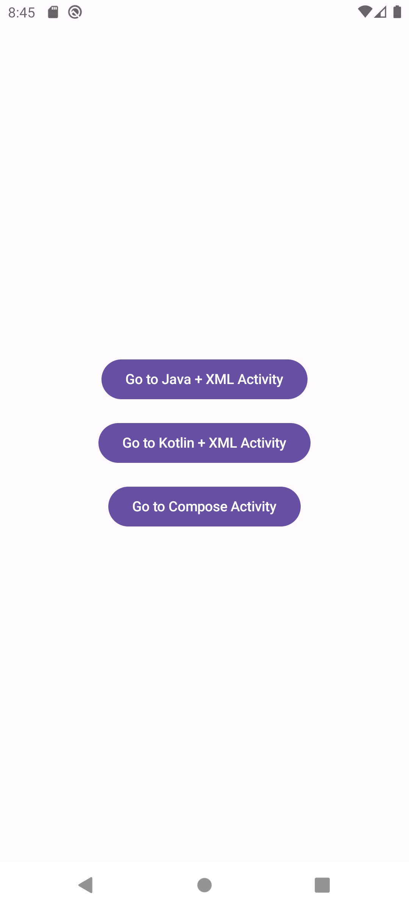
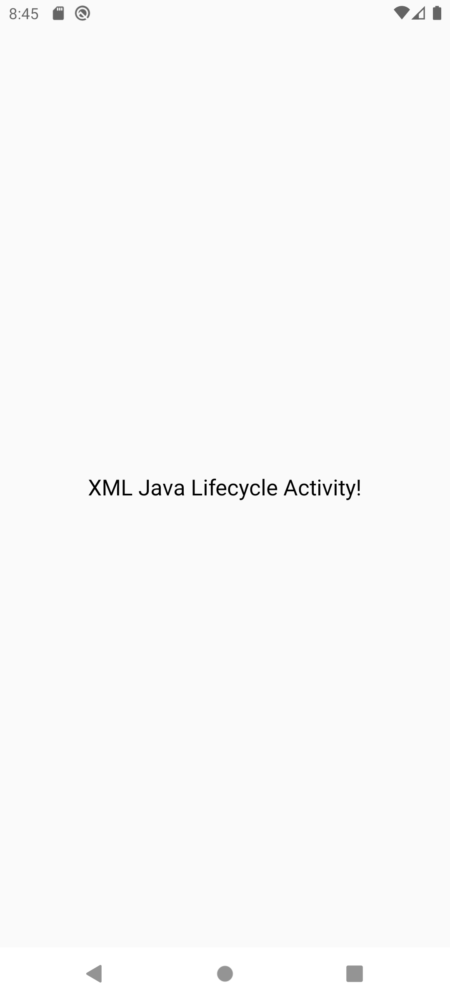
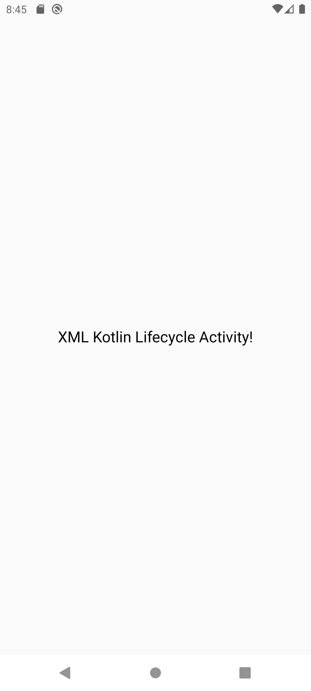
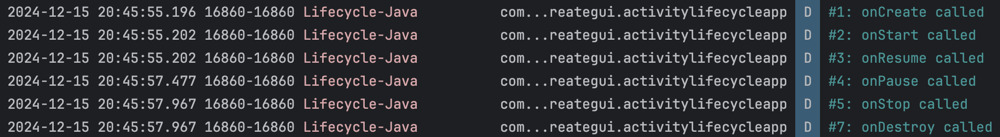
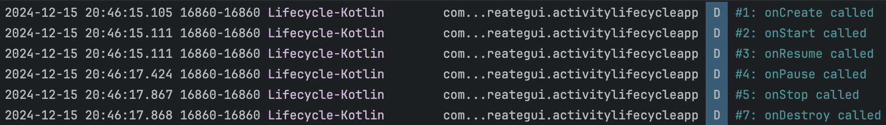
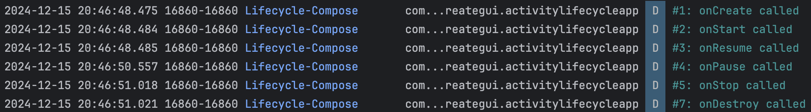

# Android Activity Lifecycle Demo App

<table>
  <tr>
    <td></td>
    <td></td>
    <td></td>
    <td></td>
  </tr>
</table>

## Descripción

Esta aplicación de Android demuestra el Ciclo de Vida de una Actividad en aplicaciones Android. Muestra la ejecución de los eventos del ciclo de vida, como onCreate, onStart, onResume, onPause, onStop, onRestart y onDestroy. El proyecto está implementado utilizando Java, Kotlin con XML y Jetpack Compose.

## Características

- **Java**: Para demostrar el ciclo de vida de una actividad utilizando Java + XML.
- **Kotlin**: Para demostrar el ciclo de vida de una actividad utilizando Kotlin + XML.
- **Jetpack Compose**: Para demostrar el ciclo de vida de una actividad utilizando Compose.
- **Intent**: Para navegar entre actividades.

## Configuraciones necesarias

- No se requiere configuración adicional.

## Eventos del Ciclo de Vida y Ejemplos

<table>
  <tr>
    <td><strong>Evento</strong></td>
    <td><strong>Descripción</strong></td>
    <td><strong>Casos de uso común</strong></td>
  </tr>
  <tr>
    <td>
        onCreate()
    </td>
    <td>
        Se llama cuando se crea la actividad. Inicializa la interfaz de usuario, las estructuras de datos y otros componentes.
    </td>
    <td>
        <ul>
            <li>Inicializar la interfaz de usuario (UI).</li>
            <li>Configurar ViewModels, adaptadores y bindings.</li>
        </ul>
    </td>
  </tr>
  <tr>
    <td>
        onStart()
    </td>
    <td>
        Se llama cuando la actividad se vuelve visible para el usuario pero aún no es interactiva.
    </td>
    <td>
        <ul>
            <li>Cargar datos ligeros.</li>
            <li>Iniciar animaciones.</li>
        </ul>
    </td>
  </tr>
  <tr>
    <td>
        onResume()
    </td>
    <td>
        Se llama cuando la actividad está lista para interactuar con el usuario (en primer plano).
    </td>
    <td>
        <ul>
            <li>Iniciar solicitudes a la API.</li>
            <li>Reanudar animaciones, reproducción o listeners de sensores.</li>
        </ul>
    </td>
  </tr>
  <tr>
    <td>
        onPause()
    </td>
    <td>
        Se llama cuando la actividad ya no está en primer plano pero aún es parcialmente visible. Se utiliza para guardar el estado y liberar recursos temporales.
    </td>
    <td>
        <ul>
            <li>Pausar animaciones o la reproducción de video.</li>
            <li>Guardar cambios no guardados.</li>
        </ul>
    </td>
  </tr>
  <tr>
    <td>
        onStop()
    </td>
    <td>
        Se llama cuando la actividad ya no es visible para el usuario.
    </td>
    <td>
        <ul>
            <li>Liberar recursos como conexiones de red.</li>
            <li>Guardar el estado de la aplicación.</li>
        </ul>
    </td>
  </tr>
  <tr>
    <td>
        onRestart()
    </td>
    <td>
        Se llama cuando la actividad se reinicia después de haberse detenido.
    </td>
    <td>
        <ul>
            <li>Reinicializar componentes o refrescar los datos si es necesario.</li>
        </ul>
    </td>
  </tr>
  <tr>
    <td>
        onDestroy()
    </td>
    <td>
        Se llama cuando se destruye la actividad. Es el último método ejecutado.
    </td>
    <td>
        <ul>
            <li>Liberar memoria y recursos.</li>
            <li>Limpiar listeners, hilos o ViewModels.</li>
        </ul>
    </td>
  </tr>
</table>

## Demostración

A continuación, algunas capturas de pantalla de la aplicación:

<table>
  <tr>
    <td></td>
    <td></td>
    <td></td>
    <td></td>
  </tr>
  <tr>
    <td colspan="4"></td>
  </tr>
  <tr>
    <td colspan="4"></td>
  </tr>
  <tr>
    <td colspan="4"></td>
  </tr>
</table>

## License 

The MIT License (MIT)

- **Copyright (c) 2024 Jonathan Reátegui**

Permission is hereby granted, free of charge, to any person obtaining a copy of this software and associated documentation files (the "Software"), to deal in the Software without restriction, including without limitation the rights to use, copy, modify, merge, publish, distribute, sublicense, and/or sell copies of the Software, and to permit persons to whom the Software is furnished to do so, subject to the following conditions:

The above copyright notice and this permission notice shall be included in all copies or substantial portions of the Software.

THE SOFTWARE IS PROVIDED "AS IS", WITHOUT WARRANTY OF ANY KIND, EXPRESS OR IMPLIED, INCLUDING BUT NOT LIMITED TO THE WARRANTIES OF MERCHANTABILITY, FITNESS FOR A PARTICULAR PURPOSE AND NONINFRINGEMENT. IN NO EVENT SHALL THE AUTHORS OR COPYRIGHT HOLDERS BE LIABLE FOR ANY CLAIM, DAMAGES OR OTHER LIABILITY, WHETHER IN AN ACTION OF CONTRACT, TORT OR OTHERWISE, ARISING FROM, OUT OF OR IN CONNECTION WITH THE SOFTWARE OR THE USE OR OTHER DEALINGS IN THE SOFTWARE.

## Notes

- This README is also available in Spanish  [here](README-es.md)
- Este README también está disponible en español  [aquí](README-es.md)
