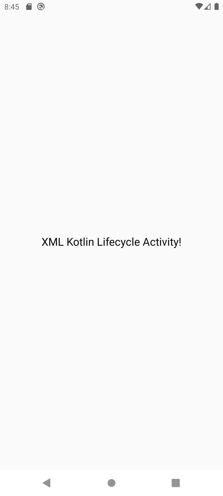
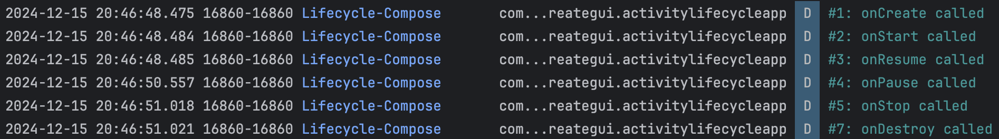

# Android Activity Lifecycle Demo App

<table>
  <tr>
    <td></td>
    <td></td>
    <td></td>
    <td></td>
  </tr>
</table>

## Description

This Android application demonstrates the Activity Lifecycle in Android applications. It logs and showcases the execution of lifecycle events such as onCreate, onStart, onResume, onPause, onStop, onRestart, and onDestroy. The project is implemented using Java, Kotlin with XML and Jetpack Compose.

## Features

- **Java**: To demonstrates the Activity Lifecycle using Java + XML.
- **Kotlin**: To demonstrates the Activity Lifecycle using Kotlin + XML.
- **Jetpack Compose**: To demonstrates the Activity Lifecycle using Compose.
- **Intent**: To navigate between activities.

## Required Configuration

- No additional configuration is required.

## Lifecycle Events and Examples

<table>
  <tr>
    <td><strong>Event</strong></td>
    <td><strong>Description</strong></td>
    <td><strong>Common Use Cases</strong></td>
  </tr>
  <tr>
    <td>
        onCreate()
    </td>
    <td>
        Called when the Activity is created. Initializes the UI, data structures, and other components.
    </td>
    <td>
        <ul>
            <li>Initialize the UI.</li>
            <li>Set up ViewModels, adapters, and bindings.</li>
        </ul>
    </td>
  </tr>
  <tr>
    <td>
        onStart()
    </td>
    <td>
        Called when the Activity becomes visible to the user but is not yet interactive.
    </td>
    <td>
        <ul>
            <li>Load lightweight data.</li>
            <li>Start animations.</li>
        </ul>
    </td>
  </tr>
  <tr>
    <td>
        onResume()
    </td>
    <td>
        Called when the Activity is ready to interact with the user (foreground).
    </td>
    <td>
        <ul>
            <li>Start API requests.</li>
            <li>Resume animations, playback, or sensor listeners.</li>
        </ul>
    </td>
  </tr>
  <tr>
    <td>
        onPause()
    </td>
    <td>
        Called when the Activity is no longer in the foreground but still partially visible. Used to save state and release temporary resources.
    </td>
    <td>
        <ul>
            <li>Pause animations or video playback.</li>
            <li>Save unsaved changes.</li>
        </ul>
    </td>
  </tr>
  <tr>
    <td>
        onStop()
    </td>
    <td>
        Called when the Activity is no longer visible to the user.
    </td>
    <td>
        <ul>
            <li>Release resources like network connections.</li>
            <li>Save app state.</li>
        </ul>
    </td>
  </tr>
  <tr>
    <td>
        onRestart()
    </td>
    <td>
        Called when the Activity is restarting after being stopped.
    </td>
    <td>
        <ul>
            <li>Reinitialize components or refresh data if needed.</li>
        </ul>
    </td>
  </tr>
  <tr>
    <td>
        onDestroy()
    </td>
    <td>
        Called when the Activity is being destroyed. It’s the last callback received.
    </td>
    <td>
        <ul>
            <li>Release memory and resources.</li>
            <li>Clean up listeners, threads, or ViewModels.</li>
        </ul>
    </td>
  </tr>
</table>

## Demo

Here are some screenshots of the application:

<table>
  <tr>
    <td></td>
    <td></td>
    <td></td>
    <td></td>
  </tr>
  <tr>
    <td colspan="4"></td>
  </tr>
  <tr>
    <td colspan="4"></td>
  </tr>
  <tr>
    <td colspan="4"></td>
  </tr>
</table>

## License 

The MIT License (MIT)

- **Copyright (c) 2024 Jonathan Reátegui**

Permission is hereby granted, free of charge, to any person obtaining a copy of this software and associated documentation files (the "Software"), to deal in the Software without restriction, including without limitation the rights to use, copy, modify, merge, publish, distribute, sublicense, and/or sell copies of the Software, and to permit persons to whom the Software is furnished to do so, subject to the following conditions:

The above copyright notice and this permission notice shall be included in all copies or substantial portions of the Software.

THE SOFTWARE IS PROVIDED "AS IS", WITHOUT WARRANTY OF ANY KIND, EXPRESS OR IMPLIED, INCLUDING BUT NOT LIMITED TO THE WARRANTIES OF MERCHANTABILITY, FITNESS FOR A PARTICULAR PURPOSE AND NONINFRINGEMENT. IN NO EVENT SHALL THE AUTHORS OR COPYRIGHT HOLDERS BE LIABLE FOR ANY CLAIM, DAMAGES OR OTHER LIABILITY, WHETHER IN AN ACTION OF CONTRACT, TORT OR OTHERWISE, ARISING FROM, OUT OF OR IN CONNECTION WITH THE SOFTWARE OR THE USE OR OTHER DEALINGS IN THE SOFTWARE.

## Notes

- This README is also available in Spanish  [here](README-es.md)
- Este README también está disponible en español  [aquí](README-es.md)
